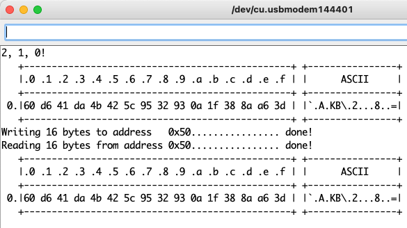

# KLoRaWAN

A fork of the LoRaWAN library for the Wio-E5, specifically targeting the Wio Terminal+LoRaWAN Chassis, which is not on GitHub, as far as I can tell. It adds a few commands and facilities:

* EEPROM: save/load bytes from the Wio E5's EEPROM.

  A `Test_EEPROM` sketch has been added to the examples.
* SNR: The `receivePacketP2PMode()` function now returns SNR along with RSSI.

  The `p2p_rx` / `p2p_tx` sketches use this facility.
* TRNG

  TRNG is used in the `Test_EEPROM` and `p2p_rx` / `p2p_tx` sketches.

I have left the `ABP` and `OTAA` sketches alone, as I am dealing only with LoRa here.

This fork will stay in place until SeeedStudio merges it back to the original – I am in contact with them and they have been very responsive.

I have also reformatted the library so it it confirms to the current standard (src folder, keywords.txt, etc).

```c
  lora.initRandom();
  uint8_t buf0[16], buf1[16], addr = lora.getLoRandomByte() & 0xF0, ix;
  lora.fillRandom(buf0, 16);
  hexDump(buf0, 16);
  memset(buf1, 0, 16);
  SerialUSB.printf("Writing 16 bytes to address   0x%02x", addr);
  for (ix = 0; ix < 16; ix++) {
    lora.setEEPROM(addr + ix, buf0[ix]);
    SerialUSB.write('.');
  }
  Serial.println(" done!");
  SerialUSB.printf("Reading 16 bytes from address 0x%02x", addr);
  for (ix = 0; ix < 16; ix++) {
    buf1[ix] = lora.getEEPROM(addr + ix);
    SerialUSB.write('.');
  }
  Serial.println(" done!");
  hexDump(buf1, 16);
```


